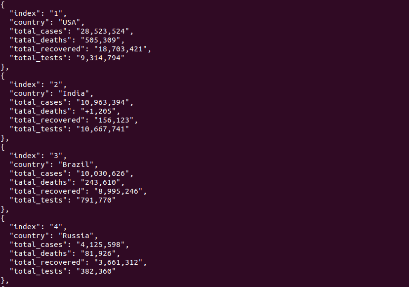

# Web Scraper Project

> This is a project built to scrape reported Cases and Deaths of COVID-19 by Country or Territory from (https://www.worldometers.info/coronavirus/).
> The scraper gets the information from the website and displays the data in JSON format and also saves the data into a csv file. Below is part of the data scrape from the site.

## Scraped results screenshot



**World covid-19 Data**

```
#Index
#Country
#total_cases
#total_deaths
#total_recovered
#total_tests

```
## Built With


- Gems used: 
- nokogiri
- HTTParty

## Getting Started

To get a local copy up and running follow these simple example steps in your terminal.

- You need to have ruby installed on your machine
- run command `git clone https://github.com/FrederickMih/web-scraper` to clone the repository
- run command `bundle install`
- go into the folder containing the project by typing `cd web-scraper`
- go into the folder containing the project by typing `cd bin`
- type in your terminal the command `ruby main.rb`

### Run tests

- Unit test (Rspec):

- go into the folder containing the project by typing `cd web-scraper`
- type in your terminal the command `rspec`

## Author

👤 **Mih Frederick Mih**

- GitHub: [@FrederickMih](https://github.com/FrederickMih)
- Twitter: [@MihFrederick](https://twitter.com/MihFrederick)
- LinkedIn: [LinkedIn](https://www.linkedin.com/in/fred-mih-495bb31a2/)

## 🤝 Contributing

Contributions, issues, and feature requests are welcome!

## Show your support

Give a ⭐️ if you like this project!

## 📝 License

Copyright 2020 Mih Frederick Ngum

Permission is hereby granted, free of charge, to any person obtaining a copy of this software and associated documentation files (the "Software"), to deal in the Software without restriction, including without limitation the rights to use, copy, modify, merge, publish, distribute, sublicense, and/or sell copies of the Software, and to permit persons to whom the Software is furnished to do so, subject to the following conditions:

The above copyright notice and this permission notice shall be included in all copies or substantial portions of the Software.

THE SOFTWARE IS PROVIDED "AS IS", WITHOUT WARRANTY OF ANY KIND, EXPRESS OR IMPLIED, INCLUDING BUT NOT LIMITED TO THE WARRANTIES OF MERCHANTABILITY, FITNESS FOR A PARTICULAR PURPOSE AND NONINFRINGEMENT. IN NO EVENT SHALL THE AUTHORS OR COPYRIGHT HOLDERS BE LIABLE FOR ANY CLAIM, DAMAGES OR OTHER LIABILITY, WHETHER IN AN ACTION OF CONTRACT, TORT OR OTHERWISE, ARISING FROM, OUT OF OR IN CONNECTION WITH THE SOFTWARE OR THE USE OR OTHER DEALINGS IN THE SOFTWARE.